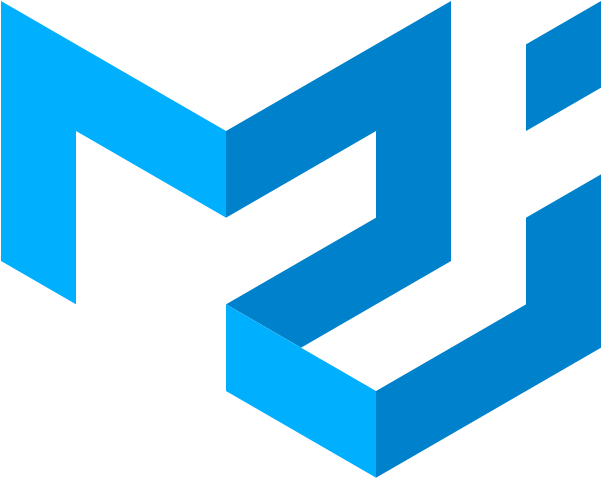

<h1 align="center"> Hey! Nice to see you </h1>

<p align="center"> 
    
           
    <a href="https://github.com/tanvirfaysal11?tab=repositories" target="_blank"></a> 
      
    <a href="https://github.com/tanvir-faysal-xeon/tanvirfaysal11" target="_blank">   
    <a href="https://github.com/tanvirfaysal11?tab=followers"></a>
    <a href="https://github.com/tanvirfaysal11/tanvirfaysal11" target="_blank"></a>
    <!--<a href="https://github.com/tanvirfaysal11" target="_blank"></a>-->
    <!---->
    <!---->
</p> 

<h3 align="center">Hi 👋, I'm Tanvir Faysal</h3>
<h3 align="center">A passionate software engineer from Bangladesh</h3>

<p align="center"> <a href="https://github.com/ryo-ma/github-profile-trophy"></a> </p>

---

### :blush: Talking about Personal Stuffs:


-  💻 &nbsp; I love exploring new tech stacks and building cool stuff.
-  📰 &nbsp; Reading tech blogs whenever possible.
-  🍕 &nbsp; Travelling, meetups & tech events.
-  🚀 &nbsp; I’m currently learning Full Stack Web Development.
-  :computer: &nbsp; Most written code line `console.log("hello world");`
-  👨🏻‍💻 &nbsp; Most of my projects are available on [Github](https://github.com/tanvir-faysal-xeon).
-  👾 &nbsp; Fun Fact: Equal is Not Always Equal in Javascript! 😹
-  📝 &nbsp; Checkout my [Website](https://tanvirfaysal11.github.io/).

---

### :dart: Languages and Tools:

> Tools, languages, and other things that I like to work with.

<table>
  <tr>
    <td align="center" width="96">
      <a href="#">
        
      </a>
      <br>HTML
    </td>
    <td align="center" width="96">
      <a href="#">
        
      </a>
      <br>CSS
    </td>
    <td align="center" width="96">
      <a href="#">
        
      </a>
      <br>Javascript
    </td>
    <td align="center" width="96">
      <a href="#">
        
      </a>
      <br>ReactJS
    </td>
    <td align="center" width="96">
      <a href="#">
        
      </a>
      <br>NextJS
    </td>
    <td align="center" width="96">
      <a href="#">
        
      </a>
      <br>Git
    </td>
    <td align="center" width="96">
      <a href="#" >
        
      </a>
      <br>Bootstrap
    </td>
    <td align="center" width="96">
      <a href="#">
        
      </a>
      <br>Postman
    </td>
    <td align="center" width="96">
      <a href="#">
        
      </a>
      <br>GraphQL
    </td>
    <td align="center" width="96"> 
      <a href="#" >
        
      </a>
      <br>TypeScript
    </td>
     <td align="center" width="96">
      <a href="#" >
        
      </a>
      <br>Microsoft .Net
    </td>
    </tr>
    <tr>
    <td align="center" width="96">
      <a href="#" >
        
      </a>
      <br>React Native
    </td>
    <td align="center"  width="96">
      <a href="#">
        
      </a>
      <br>Github
    </td>
    <td align="center"  width="96">
      <a href="#">
        
      </a>
      <br>npm
    </td>
    <td align="center" width="96">
      <a href="#" >
        
      </a>
      <br>Material Ui
    </td>
    <td align="center" width="96">
      <a href="#" >
        
      </a>
      <br>Linux
    </td>
    <td align="center" width="96">
      <a href="#" >
        
      </a>
      <br>Wordpress
    </td>
    <td align="center" width="96">
      <a href="#" >
        
      </a>
      <br>WooCommerce
    </td>
     <td align="center" width="96">
      <a href="#" >
        
      </a>
      <br>Digital Ocean
    </td>
     <td align="center" width="96">
      <a href="#" >
        
      </a>
      <br>Photoshop
    </td>
    <td align="center" width="96">
      <a href="#" >
        
      </a>
      <br>Adobe Illustrator
    </td>
    <td align="center" width="96">
      <a href="#" >
        
      </a>
      <br>Adobe XD
    </td>
  </tr>
</table>

---

### :boy: A little more about me:

```javascript
const tanvir11 = {
   name: 'Tanvir Faysal',
   pronouns: 'He' | 'Him',
   languageSpoken: ['en_US', 'bn_BD'],
   code: ['Javascript', 'HTML', 'CSS'],
   askMeAbout: ['web dev', 'tech', 'designer'],
   technologies: {
      web: {
         frontEnd: ['ReactJS', 'NextJS', 'Bootstrap', 'Tailwind CSS'],
         backEnd: ['ASP .Net', 'GraphQL',],
      },
      databases: ['MySql', 'MSSql'],
      vps: ['DigitalOcean']
   },
   currentFocus: 'Software Development',
};
```

---

### ⚙️ &nbsp;GitHub Analytics

<p align="center">
<a href="https://github.com/tanvirfaysal11">
  
  
</a>
</p>

</a>

### ⚡ &nbsp;Recent GitHub Activity
  
<a href="https://github.com/tanvirfaysal11"></a>
   
</a>

<div align="center">
<h3> Connect with me<a href="https://gifyu.com/image/Zy2f"></a>
</h3> 
<p align="center">
    <a href="https://www.linkedin.com/in/tanvir-faysal-tf11/" target="_blank"></a>
    <a href="https://www.instagram.com/tanvirfaysal11/" target="_blank"></a>
    <a href="https://www.facebook.com/tanvir.faysal.11/" target="_blank"></a>
    <a href="mailto:t.faysal45@gmail.com" target="_blank"></a> 
</p>  
